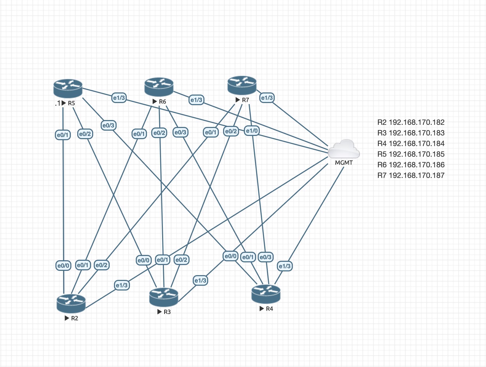

# Ansible lab automation.

Table of contents

1. [ Enviroment Overview.](#env)
2. [ Network Topology. ](#net)
3. [ Ansible configuration. ](#ans)
4. [ Playbooks. ](#play)

## 1. Enviroment Overview

This lab is built in EVE-NG which is a network virtualisation platform supports many vendors.

## 2. Network Topology

In this lab is the management interfaces are pre-configures with the following Routers:

| Hostname         | IP Address.      |
| ---------------- | ---------------- |
| R2               | 192.168.170.182  |
| R3               | 192.168.170.183  |
| R4               | 192.168.170.184  |
| R5               | 192.168.170.185  |
| R6               | 192.168.170.186  |
| R7               | 192.168.170.187  |

All Routers have a interface in Management-NAT(vmnet1), which is Routers through the management vmnet1 to the outside, towards the Ansible host.

## 3. Ansible Configuration

| File           | Discription                                                                       |
| ---------------| ----------------------------------------------------------------------------------|
| ansible.cfg.   | Standard ansible configuration file, with tweaks for vault and inventory location.|
| inv.yml        | Basic static inventory file listing all switches in the lab environment.          |
| group_vars     | placeholder for global variables related to the lab group                         |

## 4. Playbooks

build_lab.yml: Playbook which reads config from all hosts and stores it in the configs_build directory.

clean_lab.yml: Playbook which reads config from all hosts and stores it in the configs_clean directory. 
